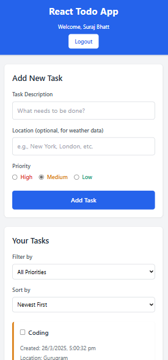

 # Advanced React Todo Application

A feature-rich Todo application built with React, Redux, and Tailwind CSS that includes user authentication, task prioritization, and weather API integration.

## Features

- User authentication (login/logout)
- Create, view, and delete tasks
- Set and update task priorities (High, Medium, Low)
- Filter and sort tasks by different criteria
- Weather integration for location-based tasks
- Responsive design for all device sizes
- Persistent storage using localStorage

## Technologies Used

- React.js
- Redux Toolkit for state management
- Redux Thunk for asynchronous actions
- Tailwind CSS for styling
- React Router for navigation
- OpenWeatherMap API for weather data

## Setup Instructions

1. Clone the repository:
git clone https://github.com/surajbhatt03/advanced-react-todo-application.git

2. Install dependencies:
npm install

3. Create a `.env` file in the root directory and add your OpenWeatherMap API key:
REACT_APP_WEATHER_API_KEY=your_api_key_here

4. Start the development server:
npm start

5. Open your browser and navigate to `http://localhost:3000`

## Usage

1. Login using any username and the password "password123"
2. Add tasks with optional location information for weather data
3. Set priority levels for your tasks
4. Filter and sort tasks as needed
5. Delete tasks when completed

## Live Demo

The application is deployed and can be accessed at: [https://surajbhatt03.github.io/advanced-react-todo-application/]

## Screenshots

